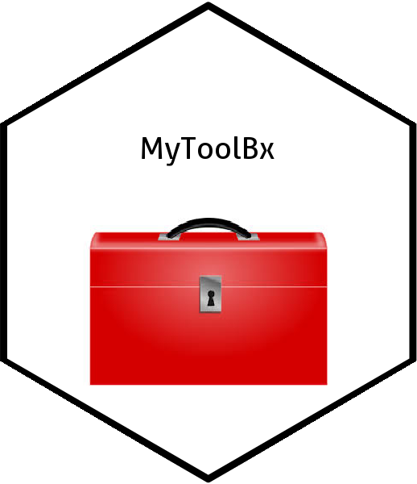
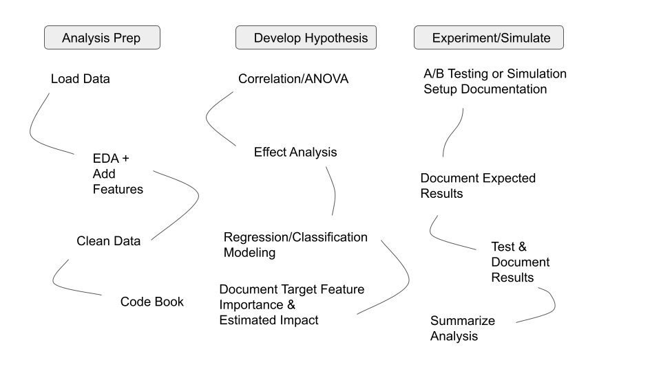

# MyToolBx

<!-- badges: start -->

<!-- badges: end -->

This package is a collection of my favorite functions from various well known packages. I will document below the functions I have collected for my workflow. I will create a website as to my methodology with more examples for using them together for analytic projects.  

**“If you steal from one author, it’s plagiarism; if you steal from many, it’s research.”**
— Wilson Mizner


## Installation

You can install the development version of MyToolBx like so:

``` r
remotes::install_github("jcvall/MyToolBX")
```

## Example


This is a basic framework which shows you how to work on a general analytics project:



``` r
library(MyToolBx)
## basic example code
```

